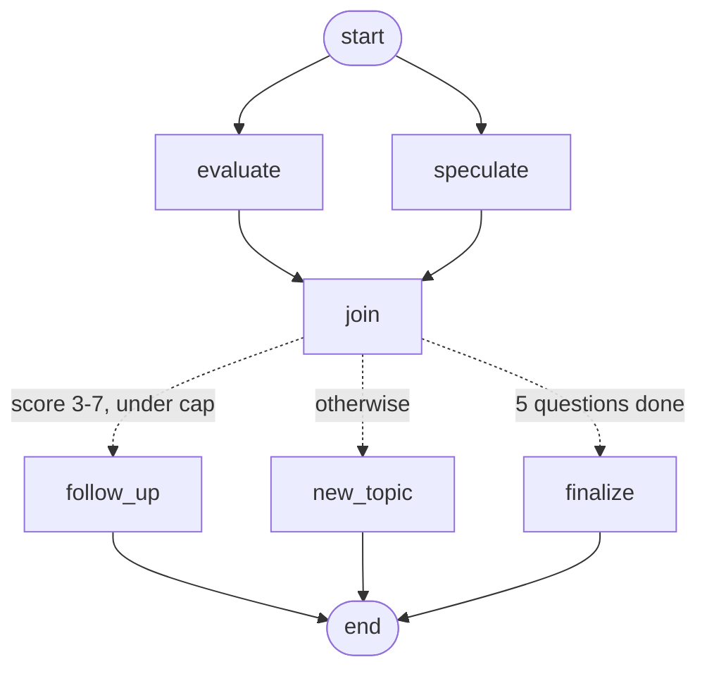

# 🤖 AI Interview Prep — AI-Powered Interview Preparation Platform

[](https://ai-interview-prep-inky-sigma.vercel.app)
[](https://nextjs.org)
[](https://typescriptlang.org)
[](https://langchain-ai.github.io/langgraphjs/)
[](https://neon.tech)
[](https://vercel.com)

> A full-stack platform where developers practice technical interviews with an AI interviewer that asks questions grounded in their own resume, probes weak answers with follow-ups, and grades every answer against a rubric written alongside the question.

---

## 🌐 Live Demo

**[https://ai-interview-prep-inky-sigma.vercel.app](https://ai-interview-prep-inky-sigma.vercel.app)**

---

## ✨ Features

- 🔐 **Authentication** — Email/password auth with NextAuth v5, JWT sessions, bcrypt hashing
- 🧠 **Interview flow as a state machine** — the turn is a LangGraph graph with parallel nodes and conditional branching
- 🤖 **AI Interviewer** — role- and difficulty-specific questions, constrained to a single topic per question
- ↳ **Adaptive follow-ups** — a partial answer is probed on the exact point it missed, instead of moving on
- 📝 **Rubric-based grading** — a grading rubric is generated *with* each question and used as the reference when scoring
- 💡 **Post-interview rubrics** — after finishing, every question shows what a strong answer needed to cover
- 📄 **Resume personalization** — upload a PDF to get questions about your actual experience, with a per-interview toggle
- 🎤 **Voice mode** — speak your answers via the Web Speech API, with text-to-speech questions
- 📋 **Interview history** — review past sessions, answers, scores and feedback
- 📊 **Analytics** — score trends and performance broken down by role and difficulty
- 📱 **Responsive** — works on phones as well as desktop

---

## 🛠️ Tech Stack

| Category | Technology |
|---|---|
| **Framework** | Next.js 16 (App Router) |
| **Language** | TypeScript |
| **Orchestration** | LangGraph (`@langchain/langgraph`) |
| **AI / LLM** | Groq API (`openai/gpt-oss-20b`) |
| **Database** | PostgreSQL (Neon) |
| **ORM** | Prisma |
| **Authentication** | NextAuth v5 |
| **Validation** | Zod |
| **Voice** | Web Speech API + react-speech-recognition |
| **Styling** | Tailwind CSS v4 |
| **PDF Parsing** | unpdf |
| **Deployment** | Vercel |

---

## 🧠 The Interview Turn as a Graph

Submitting one answer runs one graph. Grading the answer and drafting the next
question are independent, so they **fan out in parallel** and join before the
routing decision — which roughly halves the wait after each answer.



| Node | Responsibility |
|---|---|
| `evaluate` | Grades the answer against its stored rubric, records score and feedback |
| `speculate` | Drafts a fresh-topic question concurrently, used only if no follow-up is asked |
| `join` | Waits for both branches before routing |
| `follow_up` | Persists a question probing the specific gap in the answer |
| `new_topic` | Persists the pre-drafted new-topic question |
| `finalize` | Averages the scores and closes the interview |

**Follow-up policy is enforced in code, not left to the model:** the model always
identifies the biggest gap, and the graph decides whether to use it — only for
scores of 3–7, at most twice per interview, and never chaining a follow-up onto
a follow-up.

---

## 🗄️ Database Schema

```
User
 ├── id, name, email, password, emailVerified
 ├── Interviews[]
 └── Resumes[]

Interview
 ├── id, role, difficulty, status
 ├── useResume          # whether questions are drawn from the resume
 ├── score, feedback
 ├── createdAt, completedAt
 └── Questions[]

Question
 ├── id, content, order
 ├── rubric             # what a strong answer must cover (never sent mid-interview)
 ├── isFollowUp         # probes the previous answer rather than a new topic
 ├── answer, score, feedback
 └── interviewId

Resume
 ├── id, filename
 └── content (parsed text)
```

---

## 🔑 Key Implementation Details

### Authorization, not just authentication
Every interview lookup is scoped by `userId`. A request for an interview that
belongs to someone else returns **404 rather than 403**, so IDs cannot be probed
for existence. An answer's `currentQuestionId` must also belong to the interview
being answered.

### Rubric-anchored grading
The model writes a grading rubric at the same time as the question, and that
rubric is stored on the `Question` row. When grading, it is given the question,
the answer and the rubric — so the standard is fixed when the question is
written instead of being re-derived on every call. Measured effect: score spread
on a repeated answer roughly halved.

### Difficulty is applied at both ends
`Easy`/`Medium`/`Hard` shape both the question and the grading bar, with explicit
instructions not to penalise an Easy answer for lacking senior depth.

### Failures never become scores
Model output is parsed in JSON mode and validated with Zod. A malformed or
out-of-range response raises a typed error and the route returns **503 with
nothing persisted**, so the answer stays resubmittable. It is never silently
recorded as a low score.

### Question shape is validated
Generated questions are rejected and regenerated if they are compound
("...and explain..."), over 45 words, or coding exercises — the candidate answers
by typing or speaking, so "implement an LRU cache" is unanswerable here.

### Untrusted resume text
Resume content comes from a user-supplied PDF, so it is delimited and explicitly
labelled as data in the prompt, with instructions never to follow instructions
found inside it.

### Rate limiting and upload hardening
Fixed-window limits on registration (5/hr per IP), interview creation (10/min),
answer submission (30/min) and resume upload (10/hr). Uploads are capped at 5 MB
and verified by PDF magic bytes rather than the client-supplied MIME type.

### Server-side route protection
`src/proxy.ts` gates every dashboard route before render. The auth config is
split so the Edge runtime never imports Prisma or bcrypt.

---

## 🚀 Getting Started Locally

### Prerequisites
- Node.js 20+
- PostgreSQL database (or a free [Neon](https://neon.tech) account)
- [Groq API key](https://console.groq.com) (free tier works)

**1. Clone and install**
```bash
git clone https://github.com/msdianprince-7/Ai-Interview-Prep.git
cd Ai-Interview-Prep
npm install
```

**2. Set up environment variables**

Create a `.env` file in the root directory:
```env
DATABASE_URL="your_postgresql_connection_string"
AUTH_SECRET="a_random_secret"          # generate with: npx auth secret
NEXTAUTH_URL="http://localhost:3000"   # must match the deployed URL in production
GROQ_API_KEY="your_groq_api_key"
```

**3. Create the database tables**
```bash
npx prisma db push
```

> This project uses `prisma db push` rather than migration files. Do **not** run
> `prisma migrate dev` against an existing database — with no migration history
> it detects drift and offers to reset, which drops your data.

**4. Start the development server**
```bash
npm run dev
```

Open [http://localhost:3000](http://localhost:3000).

---

## 🌱 Environment Variables

| Variable | Required | Description |
|---|---|---|
| `DATABASE_URL` | ✅ | PostgreSQL connection string |
| `AUTH_SECRET` | ✅ | Auth.js v5 secret (`NEXTAUTH_SECRET` is read as a fallback) |
| `NEXTAUTH_URL` | ✅ | Base URL. **Must match the deployed domain** — Auth.js rewrites redirects to this origin, so a stale value sends users to the wrong host |
| `GROQ_API_KEY` | ✅ | Groq API key |
| `GROQ_GENERATION_MODEL` | — | Overrides the question-writing model (default `openai/gpt-oss-20b`) |
| `GROQ_EVALUATION_MODEL` | — | Overrides the grading model — point this at a stronger model to improve scoring |

---

## 📁 Project Structure

```
src/
├── app/
│   ├── (auth)/login, register
│   ├── (dashboard)/
│   │   ├── dashboard/           # Main dashboard
│   │   ├── interview/new        # Role + difficulty + resume toggle
│   │   ├── interview/[id]       # Interview room and results
│   │   ├── history/             # Past sessions
│   │   ├── analytics/           # Score trends
│   │   └── resume/              # PDF upload
│   ├── api/
│   │   ├── auth/                # NextAuth routes
│   │   ├── interview/           # Create interview, submit answer
│   │   ├── interviews/          # List interviews
│   │   ├── register/            # Registration
│   │   └── resume/              # Upload and parse
│   ├── globals.css              # Tailwind theme tokens
│   └── page.tsx                 # Landing page
├── components/ui/shell.tsx      # Shared layout primitives
├── lib/
│   ├── interview-graph.ts       # LangGraph state machine
│   ├── openai.ts                # Question generation + grading (Groq)
│   ├── api.ts                   # Session helper, typed HTTP responses
│   ├── validation.ts            # Zod schemas and interview constants
│   ├── rate-limit.ts            # Fixed-window limiter
│   ├── resume.ts                # Resume data access
│   └── prisma.ts                # Prisma client
├── auth.ts                      # NextAuth (Node runtime)
├── auth.config.ts               # Edge-safe auth config
└── proxy.ts                     # Route protection
```

---

## ⚠️ Known Limitations

Kept here deliberately — these are the honest gaps, not a wish list.

- **No automated tests or CI.** The highest-priority next step.
- **Rate limiting is in-process.** On multiple instances each keeps its own
  counters; a shared store (Upstash/Redis) is needed before scaling out.
- **Groq free-tier token limits** (~8k TPM) will surface as 429s under
  concurrent use.
- **No checkpointer on the graph**, so recovery from a partially-failed turn is
  handled manually in the route rather than by LangGraph.
- **Screenshots below predate the Tailwind rewrite** and may not match the
  current UI exactly.

---

## 📸 Screenshots

### Landing Page


### Dashboard


### Interview Room


### Voice Mode


### Text Mode


### Analytics Dashboard


---

## 🚢 Deployment

Deployed on **Vercel** with a **Neon PostgreSQL** database.

To deploy your own instance:
1. Fork this repository
2. Import it into Vercel
3. Add the environment variables above — set `NEXTAUTH_URL` to your deployed domain
4. Deploy

`prisma generate` runs on both `postinstall` and `build`, so a cached
`node_modules` on the build machine cannot produce a stale Prisma Client.

---

## 🤝 Contributing

Contributions are welcome.

1. Fork the project
2. Create your feature branch (`git checkout -b feature/AmazingFeature`)
3. Commit your changes (`git commit -m 'feat: add AmazingFeature'`)
4. Push to the branch (`git push origin feature/AmazingFeature`)
5. Open a Pull Request

---

## 📄 License

Open source under the [MIT License](LICENSE).

---

## 👨‍💻 Author

**msdianprince-7**
- GitHub: [@msdianprince-7](https://github.com/msdianprince-7)
- Live Project: [ai-interview-prep-inky-sigma.vercel.app](https://ai-interview-prep-inky-sigma.vercel.app)

---

<div align="center">
  <p>Built with Next.js, LangGraph, Prisma, NextAuth and Groq</p>
  <p>⭐ Star this repo if you found it helpful!</p>
</div>
